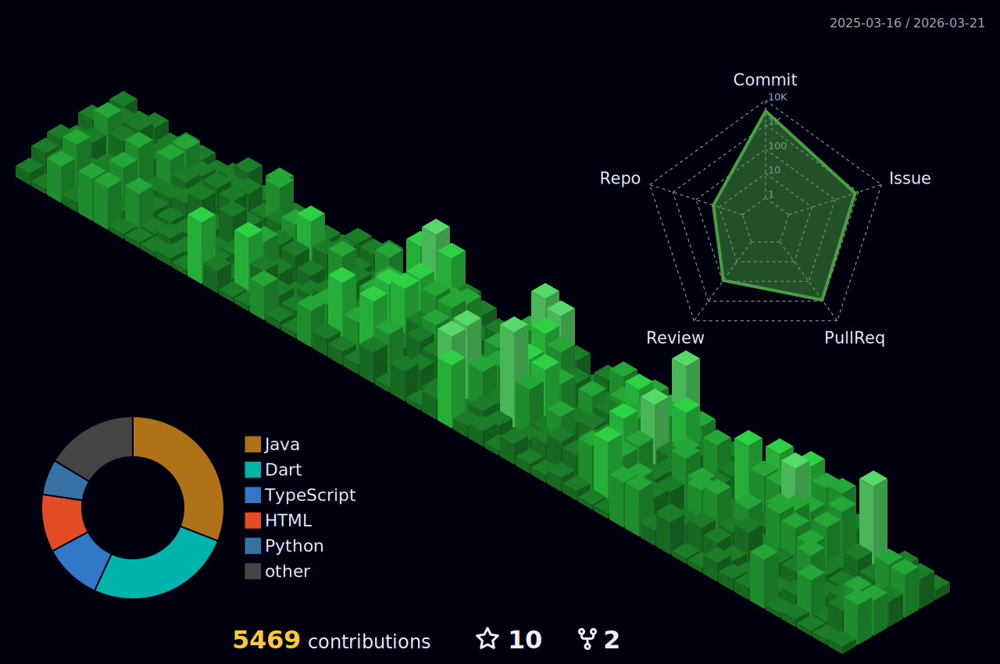

<!-- Cassiiopeia's standout GitHub Profile README -->

<p align="center">
  
</p>

<p align="center">
  
</p>

<p align="center">
  
  
  
  
  
</p>

---

## 👋 About Me

- **Java & Spring Boot 기반 백엔드 개발자**  
- **React, Flutter, Node.js, TypeScript 등 풀스택 경험**
- **활동적인 사이드 프로젝트 러버**

---

<!-- 수정하지마세요 자동으로 동기화 됩니다 -->
## 최신 버전 : v1.0.0
[전체 버전 기록 보기](CHANGELOG.md)

## 🛠️ Tech Stack

### 💻 Backend
<p>
  
  
  
  
  
  
  
  
</p>

### ☁️ Infra & DevOps
<p>
  
  
  
</p>

### 🖥️ Frontend & Cross-platform
<p>
  
  
  
  
  
  
  
  <br/>
  
  
  
</p>

### 🧠 AI/ML & 기타
<p>
  
  
  
</p>

---

## 🌟 Featured Projects

### 🚀 [RomRom](https://github.com/TEAM-ROMROM/RomRom-BE) | [FE](https://github.com/TEAM-ROMROM/RomRom-FE)
> **물물교환 시스템 + AI 가격측정 + 알고리즘 물건 매칭**
- 실시간 물건 매칭/추천, AI 기반 가격 산정, 사용자 친화적 물물교환 플랫폼
- 백엔드, 프론트엔드 모두 참여

### 🦜 [Malsami](https://github.com/Sejong-Balsamic/Malsami-BE)
> **대학 교육관리 시스템**
- 자료/질문 게시판, 임베딩 기반 AI 자료 추천, 강의 관리 등
- AI/검색/추천/임베딩 시스템 백엔드 개발

---

## ⏰ Coding Stats

<!--START_SECTION:waka-->


**🐱 저의 GitHub 정보에요.** 

> 📦 GitHub의 22.2 kB만큼의 저장소를 사용하고 있어요. 
 > 
> 🏆 3,132 만큼의 Contributions을 2025년에 했어요
 > 
> 🚫 구직중이지 않아요.
 > 
> 📜 37개의 Public Repository를 만들었어요. 
 > 
> 🔑 19개의 Private Repository를 만들었어요. 
 > 
**저는 저녁형 인간이에요. 🦉** 

```text
🌞 아침                     5182 commits        ⬛⬜⬜⬜⬜⬜⬜⬜⬜⬜⬜⬜⬜⬜⬜⬜⬜⬜⬜⬜⬜⬜⬜⬜⬜   05.92 % 
🌆 낮　                     22106 commits       ⬛⬛⬛⬛⬛⬛⬜⬜⬜⬜⬜⬜⬜⬜⬜⬜⬜⬜⬜⬜⬜⬜⬜⬜⬜   25.24 % 
🌃 저녁                     40588 commits       ⬛⬛⬛⬛⬛⬛⬛⬛⬛⬛⬛⬛⬜⬜⬜⬜⬜⬜⬜⬜⬜⬜⬜⬜⬜   46.34 % 
🌙 밤　                     19714 commits       ⬛⬛⬛⬛⬛⬛⬜⬜⬜⬜⬜⬜⬜⬜⬜⬜⬜⬜⬜⬜⬜⬜⬜⬜⬜   22.51 % 
```
📅 **제가 가장 생산적인 날은 금요일이에요.** 

```text
월요일                      11832 commits       ⬛⬛⬛⬜⬜⬜⬜⬜⬜⬜⬜⬜⬜⬜⬜⬜⬜⬜⬜⬜⬜⬜⬜⬜⬜   13.51 % 
화요일                      17468 commits       ⬛⬛⬛⬛⬛⬜⬜⬜⬜⬜⬜⬜⬜⬜⬜⬜⬜⬜⬜⬜⬜⬜⬜⬜⬜   19.94 % 
수요일                      10550 commits       ⬛⬛⬛⬜⬜⬜⬜⬜⬜⬜⬜⬜⬜⬜⬜⬜⬜⬜⬜⬜⬜⬜⬜⬜⬜   12.04 % 
목요일                      8087 commits        ⬛⬛⬜⬜⬜⬜⬜⬜⬜⬜⬜⬜⬜⬜⬜⬜⬜⬜⬜⬜⬜⬜⬜⬜⬜   09.23 % 
금요일                      19018 commits       ⬛⬛⬛⬛⬛⬜⬜⬜⬜⬜⬜⬜⬜⬜⬜⬜⬜⬜⬜⬜⬜⬜⬜⬜⬜   21.71 % 
토요일                      9663 commits        ⬛⬛⬛⬜⬜⬜⬜⬜⬜⬜⬜⬜⬜⬜⬜⬜⬜⬜⬜⬜⬜⬜⬜⬜⬜   11.03 % 
일요일                      10972 commits       ⬛⬛⬛⬜⬜⬜⬜⬜⬜⬜⬜⬜⬜⬜⬜⬜⬜⬜⬜⬜⬜⬜⬜⬜⬜   12.53 % 
```


📊 **저는 이번주를 이렇게 시간을 보냈어요.** 

```text
🕑︎ Timezone: Asia/Seoul

💬 프로그래밍 언어들: 
Java                     8 hrs 12 mins       ⬛⬛⬛⬛⬛⬛⬛⬛⬛⬛⬛⬛⬜⬜⬜⬜⬜⬜⬜⬜⬜⬜⬜⬜⬜   49.50 % 
YAML                     2 hrs 13 mins       ⬛⬛⬛⬜⬜⬜⬜⬜⬜⬜⬜⬜⬜⬜⬜⬜⬜⬜⬜⬜⬜⬜⬜⬜⬜   13.40 % 
HTML                     1 hr 44 mins        ⬛⬛⬛⬜⬜⬜⬜⬜⬜⬜⬜⬜⬜⬜⬜⬜⬜⬜⬜⬜⬜⬜⬜⬜⬜   10.48 % 
Markdown                 1 hr 24 mins        ⬛⬛⬜⬜⬜⬜⬜⬜⬜⬜⬜⬜⬜⬜⬜⬜⬜⬜⬜⬜⬜⬜⬜⬜⬜   08.53 % 
Gradle                   48 mins             ⬛⬜⬜⬜⬜⬜⬜⬜⬜⬜⬜⬜⬜⬜⬜⬜⬜⬜⬜⬜⬜⬜⬜⬜⬜   04.84 % 

🔥 에디터들: 
IntelliJ IDEA            13 hrs 33 mins      ⬛⬛⬛⬛⬛⬛⬛⬛⬛⬛⬛⬛⬛⬛⬛⬛⬛⬛⬛⬛⬜⬜⬜⬜⬜   81.76 % 
Cursor                   3 hrs 1 min         ⬛⬛⬛⬛⬛⬜⬜⬜⬜⬜⬜⬜⬜⬜⬜⬜⬜⬜⬜⬜⬜⬜⬜⬜⬜   18.24 % 

🐱‍💻 프로젝트들: 
RomRom-BE                7 hrs 50 mins       ⬛⬛⬛⬛⬛⬛⬛⬛⬛⬛⬛⬛⬜⬜⬜⬜⬜⬜⬜⬜⬜⬜⬜⬜⬜   47.29 % 
suh-logger               3 hrs 10 mins       ⬛⬛⬛⬛⬛⬜⬜⬜⬜⬜⬜⬜⬜⬜⬜⬜⬜⬜⬜⬜⬜⬜⬜⬜⬜   19.16 % 
suh-project-utility      2 hrs 30 mins       ⬛⬛⬛⬛⬜⬜⬜⬜⬜⬜⬜⬜⬜⬜⬜⬜⬜⬜⬜⬜⬜⬜⬜⬜⬜   15.16 % 
suh-api-log              1 hr 29 mins        ⬛⬛⬜⬜⬜⬜⬜⬜⬜⬜⬜⬜⬜⬜⬜⬜⬜⬜⬜⬜⬜⬜⬜⬜⬜   09.02 % 
Malsami-BE               1 hr                ⬛⬛⬜⬜⬜⬜⬜⬜⬜⬜⬜⬜⬜⬜⬜⬜⬜⬜⬜⬜⬜⬜⬜⬜⬜   06.12 % 

💻 운영 체제들: 
Mac                      16 hrs 35 mins      ⬛⬛⬛⬛⬛⬛⬛⬛⬛⬛⬛⬛⬛⬛⬛⬛⬛⬛⬛⬛⬛⬛⬛⬛⬛   100.00 % 
```

**저는 주로 Java 언어를 사용해요.** 

```text
Java                     32 repos            ⬛⬛⬛⬛⬛⬛⬛⬛⬛⬛⬛⬛⬛⬛⬛⬛⬜⬜⬜⬜⬜⬜⬜⬜⬜   64.00 % 
TypeScript               4 repos             ⬛⬛⬜⬜⬜⬜⬜⬜⬜⬜⬜⬜⬜⬜⬜⬜⬜⬜⬜⬜⬜⬜⬜⬜⬜   08.00 % 
JavaScript               4 repos             ⬛⬛⬜⬜⬜⬜⬜⬜⬜⬜⬜⬜⬜⬜⬜⬜⬜⬜⬜⬜⬜⬜⬜⬜⬜   08.00 % 
HTML                     1 repo              ⬜⬜⬜⬜⬜⬜⬜⬜⬜⬜⬜⬜⬜⬜⬜⬜⬜⬜⬜⬜⬜⬜⬜⬜⬜   02.00 % 
Dart                     1 repo              ⬜⬜⬜⬜⬜⬜⬜⬜⬜⬜⬜⬜⬜⬜⬜⬜⬜⬜⬜⬜⬜⬜⬜⬜⬜   02.00 % 
```


 Last Updated on 2025년 09월 21일 18:53:48 UTC UTC
<!--END_SECTION:waka-->

---

## 📈 My GitHub Life



<picture>
  <source media="(prefers-color-scheme: dark)" srcset="https://raw.githubusercontent.com/Cassiiopeia/Cassiiopeia/output/github-contribution-grid-snake-dark.svg">
  <source media="(prefers-color-scheme: light)" srcset="https://raw.githubusercontent.com/Cassiiopeia/Cassiiopeia/output/github-contribution-grid-snake.svg">
  
</picture>
<p align="center">
  
</p>
<p align="center">
  
</p>
<p align="center">
  
  
</p>
<p align="center">
  
</p>

---

## 🤸‍♂️ Fun Facts

- 🧑‍💻 **MBTI:** ESTJ (논리적이고, 리더십 강한 타입)
- 🛠️ 취미: 사이드 프로젝트, LOL, 여행, 영상편집
- 🚀 새로운 협업/아이디어 언제나 환영합니다!

---

<p align="center">
  
</p>
