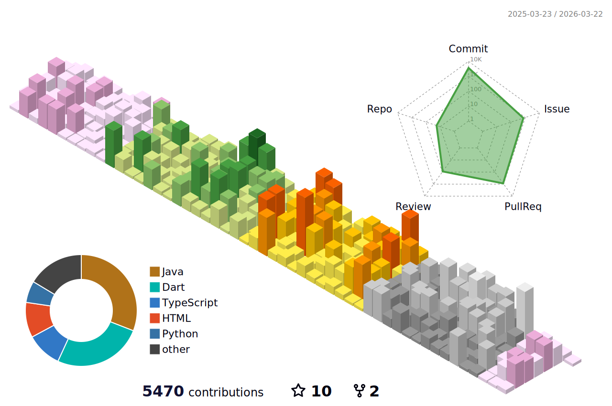

<!-- Cassiiopeia's GitHub Profile README -->

<p align="center">
  
</p>

<p align="center">
  
</p>

<p align="center">
  <a href="https://lab.suhsaechan.kr"></a>
</p>

<p align="center">
  
  
</p>

---

## 👨‍💻 About Me

<table>
<tr>
<td width="65%" valign="top">

### Hi, I'm Saechan Suh

**Backend Developer** specializing in **Java & Spring Boot**, building reliable and scalable systems.

Full-stack experience from **React/Flutter** to **AWS/Docker**.

Side project enthusiast who loves experimenting with new tech.

</td>
<td width="35%" valign="top">

### Quick Facts

| | |
|:--|:--|
| 💼 | **Somansa** Server Module Team |
| 🧠 | MBTI: **ESTJ** |
| 🎮 | LOL, 여행, 영상편집 |
| 🚀 | 새로운 협업 환영! |

</td>
</tr>
</table>

---

<!-- 수정하지마세요 자동으로 동기화 됩니다 -->
## 최신 버전 : v1.2.2 (2026-01-01)
[전체 버전 기록 보기](CHANGELOG.md)

---

## 🚀 Featured Projects

<table>
<tr>
<td width="50%" valign="top">

### 🔄 RomRom
**물물교환 + AI 가격측정 플랫폼**

[](https://github.com/TEAM-ROMROM/RomRom-BE)
[](https://github.com/TEAM-ROMROM/RomRom-FE)

`2024.10 ~ 진행 중`

- 실시간 물건 매칭/추천
- AI 기반 가격 산정
- 풀스택 참여


</td>
<td width="50%" valign="top">

### 🌍 Tripgether
**AI 여행 가이드 시스템**

[](https://github.com/TEAM-Tripgether/Tripgether-BE)
[](https://github.com/TEAM-Tripgether/Tripgether-python)

`2025.09 ~ 2025.11`

- SNS에서 장소 정보 AI 자동 추출
- 개인 여행 지도 생성
- 여행 코스 자동 생성


</td>
</tr>
<tr>
<td width="50%" valign="top">

### 🦜 Malsami
**대학 교육관리 시스템**

[](https://github.com/Sejong-Balsamic/Malsami-BE)
[](https://github.com/Sejong-Balsamic/Malsami-FE)

`2023.03 ~ 2024.03`

- 자료/질문 게시판
- 임베딩 기반 AI 자료 추천
- 강의 관리 시스템


</td>
<td width="50%" valign="top">

### 🔬 More Projects

**[lab.suhsaechan.kr](https://lab.suhsaechan.kr/)** 에서 더 많은 프로젝트와 실험들을 확인하세요!

[](https://lab.suhsaechan.kr/)

</td>
</tr>
</table>

---

## 🛠️ Tech Stack

| Category | Technologies |
|:---------|:-------------|
| **Languages** |      |
| **Backend** |      |
| **Frontend** |     |
| **Database** |      |
| **AI/ML** |     |
| **DevOps** |     |

---

## 📊 GitHub Stats

<p align="center">
  
</p>

<p align="center">
  <picture>
    <source media="(prefers-color-scheme: dark)" srcset="https://raw.githubusercontent.com/Cassiiopeia/Cassiiopeia/output/github-contribution-grid-snake-dark.svg">
    <source media="(prefers-color-scheme: light)" srcset="https://raw.githubusercontent.com/Cassiiopeia/Cassiiopeia/output/github-contribution-grid-snake.svg">
    
  </picture>
</p>

<p align="center">
  
  
</p>

<p align="center">
  
</p>

### 🏆 Trophies

<p align="center">
  
</p>

---

## ⏰ Coding Stats

<!--START_SECTION:waka-->


**🐱 저의 GitHub 정보에요.** 

> 📦 GitHub의 28.5 kB만큼의 저장소를 사용하고 있어요. 
 > 
> 🏆 266 만큼의 Contributions을 2026년에 했어요
 > 
> 🚫 구직중이지 않아요.
 > 
> 📜 44개의 Public Repository를 만들었어요. 
 > 
> 🔑 19개의 Private Repository를 만들었어요. 
 > 
**저는 저녁형 인간이에요. 🦉** 

```text
🌞 아침                     8042 commits        ⬛⬛⬜⬜⬜⬜⬜⬜⬜⬜⬜⬜⬜⬜⬜⬜⬜⬜⬜⬜⬜⬜⬜⬜⬜   06.36 % 
🌆 낮　                     33165 commits       ⬛⬛⬛⬛⬛⬛⬛⬜⬜⬜⬜⬜⬜⬜⬜⬜⬜⬜⬜⬜⬜⬜⬜⬜⬜   26.21 % 
🌃 저녁                     58345 commits       ⬛⬛⬛⬛⬛⬛⬛⬛⬛⬛⬛⬛⬜⬜⬜⬜⬜⬜⬜⬜⬜⬜⬜⬜⬜   46.11 % 
🌙 밤　                     26978 commits       ⬛⬛⬛⬛⬛⬜⬜⬜⬜⬜⬜⬜⬜⬜⬜⬜⬜⬜⬜⬜⬜⬜⬜⬜⬜   21.32 % 
```
📅 **제가 가장 생산적인 날은 화요일이에요.** 

```text
월요일                      19803 commits       ⬛⬛⬛⬛⬜⬜⬜⬜⬜⬜⬜⬜⬜⬜⬜⬜⬜⬜⬜⬜⬜⬜⬜⬜⬜   15.65 % 
화요일                      23914 commits       ⬛⬛⬛⬛⬛⬜⬜⬜⬜⬜⬜⬜⬜⬜⬜⬜⬜⬜⬜⬜⬜⬜⬜⬜⬜   18.90 % 
수요일                      15275 commits       ⬛⬛⬛⬜⬜⬜⬜⬜⬜⬜⬜⬜⬜⬜⬜⬜⬜⬜⬜⬜⬜⬜⬜⬜⬜   12.07 % 
목요일                      14103 commits       ⬛⬛⬛⬜⬜⬜⬜⬜⬜⬜⬜⬜⬜⬜⬜⬜⬜⬜⬜⬜⬜⬜⬜⬜⬜   11.15 % 
금요일                      22352 commits       ⬛⬛⬛⬛⬜⬜⬜⬜⬜⬜⬜⬜⬜⬜⬜⬜⬜⬜⬜⬜⬜⬜⬜⬜⬜   17.67 % 
토요일                      12059 commits       ⬛⬛⬜⬜⬜⬜⬜⬜⬜⬜⬜⬜⬜⬜⬜⬜⬜⬜⬜⬜⬜⬜⬜⬜⬜   09.53 % 
일요일                      19024 commits       ⬛⬛⬛⬛⬜⬜⬜⬜⬜⬜⬜⬜⬜⬜⬜⬜⬜⬜⬜⬜⬜⬜⬜⬜⬜   15.04 % 
```


📊 **저는 이번주를 이렇게 시간을 보냈어요.** 

```text
🕑︎ Timezone: Asia/Seoul

💬 프로그래밍 언어들: 
YAML                     2 hrs 28 mins       ⬛⬛⬛⬛⬛⬛⬛⬛⬛⬜⬜⬜⬜⬜⬜⬜⬜⬜⬜⬜⬜⬜⬜⬜⬜   36.43 % 
Python                   1 hr 25 mins        ⬛⬛⬛⬛⬛⬜⬜⬜⬜⬜⬜⬜⬜⬜⬜⬜⬜⬜⬜⬜⬜⬜⬜⬜⬜   20.84 % 
Markdown                 1 hr                ⬛⬛⬛⬛⬜⬜⬜⬜⬜⬜⬜⬜⬜⬜⬜⬜⬜⬜⬜⬜⬜⬜⬜⬜⬜   14.88 % 
Java                     49 mins             ⬛⬛⬛⬜⬜⬜⬜⬜⬜⬜⬜⬜⬜⬜⬜⬜⬜⬜⬜⬜⬜⬜⬜⬜⬜   11.99 % 
Dart                     23 mins             ⬛⬜⬜⬜⬜⬜⬜⬜⬜⬜⬜⬜⬜⬜⬜⬜⬜⬜⬜⬜⬜⬜⬜⬜⬜   05.75 % 

🔥 에디터들: 
IntelliJ IDEA            5 hrs               ⬛⬛⬛⬛⬛⬛⬛⬛⬛⬛⬛⬛⬛⬛⬛⬛⬛⬛⬜⬜⬜⬜⬜⬜⬜   73.42 % 
Cursor                   1 hr 48 mins        ⬛⬛⬛⬛⬛⬛⬛⬜⬜⬜⬜⬜⬜⬜⬜⬜⬜⬜⬜⬜⬜⬜⬜⬜⬜   26.58 % 

🐱‍💻 프로젝트들: 
MapSee-AI                3 hrs 28 mins       ⬛⬛⬛⬛⬛⬛⬛⬛⬛⬛⬛⬛⬛⬜⬜⬜⬜⬜⬜⬜⬜⬜⬜⬜⬜   50.88 % 
MapSee-BE                1 hr 6 mins         ⬛⬛⬛⬛⬜⬜⬜⬜⬜⬜⬜⬜⬜⬜⬜⬜⬜⬜⬜⬜⬜⬜⬜⬜⬜   16.21 % 
RomRom-FE                51 mins             ⬛⬛⬛⬜⬜⬜⬜⬜⬜⬜⬜⬜⬜⬜⬜⬜⬜⬜⬜⬜⬜⬜⬜⬜⬜   12.65 % 
1-cm-main-branch         48 mins             ⬛⬛⬛⬜⬜⬜⬜⬜⬜⬜⬜⬜⬜⬜⬜⬜⬜⬜⬜⬜⬜⬜⬜⬜⬜   11.83 % 
SUH-DEVOPS-TEMPLATE      7 mins              ⬜⬜⬜⬜⬜⬜⬜⬜⬜⬜⬜⬜⬜⬜⬜⬜⬜⬜⬜⬜⬜⬜⬜⬜⬜   01.79 % 

💻 운영 체제들: 
Mac                      5 hrs 30 mins       ⬛⬛⬛⬛⬛⬛⬛⬛⬛⬛⬛⬛⬛⬛⬛⬛⬛⬛⬛⬛⬜⬜⬜⬜⬜   80.92 % 
Windows                  1 hr 17 mins        ⬛⬛⬛⬛⬛⬜⬜⬜⬜⬜⬜⬜⬜⬜⬜⬜⬜⬜⬜⬜⬜⬜⬜⬜⬜   19.08 % 
```

**저는 주로 Java 언어를 사용해요.** 

```text
Java                     35 repos            ⬛⬛⬛⬛⬛⬛⬛⬛⬛⬛⬛⬛⬛⬛⬜⬜⬜⬜⬜⬜⬜⬜⬜⬜⬜   56.45 % 
Python                   8 repos             ⬛⬛⬛⬜⬜⬜⬜⬜⬜⬜⬜⬜⬜⬜⬜⬜⬜⬜⬜⬜⬜⬜⬜⬜⬜   12.90 % 
TypeScript               4 repos             ⬛⬛⬜⬜⬜⬜⬜⬜⬜⬜⬜⬜⬜⬜⬜⬜⬜⬜⬜⬜⬜⬜⬜⬜⬜   06.45 % 
HTML                     2 repos             ⬛⬜⬜⬜⬜⬜⬜⬜⬜⬜⬜⬜⬜⬜⬜⬜⬜⬜⬜⬜⬜⬜⬜⬜⬜   03.23 % 
PowerShell               1 repo              ⬜⬜⬜⬜⬜⬜⬜⬜⬜⬜⬜⬜⬜⬜⬜⬜⬜⬜⬜⬜⬜⬜⬜⬜⬜   01.61 % 
```


**타임라인**


 Last Updated on 2026년 01월 16일 19:04:21 UTC UTC
<!--END_SECTION:waka-->

---

<p align="center">
  
</p>
