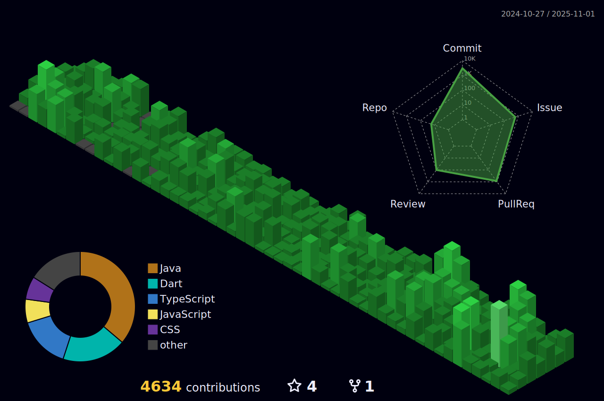

<!-- Cassiiopeia's standout GitHub Profile README -->

<p align="center">
  
</p>

<p align="center">
  
</p>

<p align="center">
  
  
  
  
  
</p>

---

## 👋 About Me

- **Java & Spring Boot 기반 백엔드 개발자**  
- **React, Flutter, Node.js, TypeScript 등 풀스택 경험**
- **활동적인 사이드 프로젝트 러버**

---

<!-- 수정하지마세요 자동으로 동기화 됩니다 -->
## 최신 버전 : v1.1.2 (2025-11-25)
[전체 버전 기록 보기](CHANGELOG.md)

## 🛠️ Tech Stack

### 💻 Backend
<p>
  
  
  
  
  
  
  
  
</p>

### ☁️ Infra & DevOps
<p>
  
  
  
</p>

### 🖥️ Frontend & Cross-platform
<p>
  
  
  
  
  
  
  
  <br/>
  
  
  
</p>

### 🧠 AI/ML & 기타
<p>
  
  
  
</p>

---

## 🌟 Featured Projects

### 🚀 [RomRom-BE](https://github.com/TEAM-ROMROM/RomRom-BE) | [RomRom-FE](https://github.com/TEAM-ROMROM/RomRom-FE)
(2024.10 ~ 진행 중)
> **물물교환 시스템 + AI 가격측정 + 알고리즘 물건 매칭**
- 실시간 물건 매칭/추천, AI 기반 가격 산정, 사용자 친화적 물물교환 플랫폼
- 백엔드, 프론트엔드 모두 참여

### 🌍 [Tripgether-BE](https://github.com/TEAM-Tripgether/Tripgether-BE) | [Tripgether-AI](https://github.com/TEAM-Tripgether/Tripgether-python)
(2025.09 ~ 2025.11)
> ** AI를 활용한 여행 가이드 시스템**
- SNS(릴스·쇼츠·사진)에서 장소 정보를 AI로 자동 추출해 개인 여행 지도를 생성해주는 서비스
- 여행 코스·가이드 자동 생성 판매까지 연결되는 여행 가이드 플랫폼

### 🦜 [Malsami-BE](https://github.com/Sejong-Balsamic/Malsami-BE) | [Malsami-FE](https://github.com/Sejong-Balsamic/Malsami-BE)
(2023.03 ~ 2024.03)
> **대학 교육관리 시스템**
- 자료/질문 게시판, 임베딩 기반 AI 자료 추천, 강의 관리 등
- AI/검색/추천/임베딩 시스템 백엔드 개발

---

## ⏰ Coding Stats

<!--START_SECTION:waka-->


**🐱 저의 GitHub 정보에요.** 

> 📦 GitHub의 24.1 kB만큼의 저장소를 사용하고 있어요. 
 > 
> 🏆 4,359 만큼의 Contributions을 2025년에 했어요
 > 
> 🚫 구직중이지 않아요.
 > 
> 📜 41개의 Public Repository를 만들었어요. 
 > 
> 🔑 19개의 Private Repository를 만들었어요. 
 > 
**저는 저녁형 인간이에요. 🦉** 

```text
🌞 아침                     6899 commits        ⬛⬛⬜⬜⬜⬜⬜⬜⬜⬜⬜⬜⬜⬜⬜⬜⬜⬜⬜⬜⬜⬜⬜⬜⬜   06.27 % 
🌆 낮　                     28711 commits       ⬛⬛⬛⬛⬛⬛⬛⬜⬜⬜⬜⬜⬜⬜⬜⬜⬜⬜⬜⬜⬜⬜⬜⬜⬜   26.08 % 
🌃 저녁                     50558 commits       ⬛⬛⬛⬛⬛⬛⬛⬛⬛⬛⬛⬜⬜⬜⬜⬜⬜⬜⬜⬜⬜⬜⬜⬜⬜   45.93 % 
🌙 밤　                     23901 commits       ⬛⬛⬛⬛⬛⬜⬜⬜⬜⬜⬜⬜⬜⬜⬜⬜⬜⬜⬜⬜⬜⬜⬜⬜⬜   21.71 % 
```
📅 **제가 가장 생산적인 날은 금요일이에요.** 

```text
월요일                      16117 commits       ⬛⬛⬛⬛⬜⬜⬜⬜⬜⬜⬜⬜⬜⬜⬜⬜⬜⬜⬜⬜⬜⬜⬜⬜⬜   14.64 % 
화요일                      20838 commits       ⬛⬛⬛⬛⬛⬜⬜⬜⬜⬜⬜⬜⬜⬜⬜⬜⬜⬜⬜⬜⬜⬜⬜⬜⬜   18.93 % 
수요일                      13616 commits       ⬛⬛⬛⬜⬜⬜⬜⬜⬜⬜⬜⬜⬜⬜⬜⬜⬜⬜⬜⬜⬜⬜⬜⬜⬜   12.37 % 
목요일                      12152 commits       ⬛⬛⬛⬜⬜⬜⬜⬜⬜⬜⬜⬜⬜⬜⬜⬜⬜⬜⬜⬜⬜⬜⬜⬜⬜   11.04 % 
금요일                      20915 commits       ⬛⬛⬛⬛⬛⬜⬜⬜⬜⬜⬜⬜⬜⬜⬜⬜⬜⬜⬜⬜⬜⬜⬜⬜⬜   19.00 % 
토요일                      11060 commits       ⬛⬛⬛⬜⬜⬜⬜⬜⬜⬜⬜⬜⬜⬜⬜⬜⬜⬜⬜⬜⬜⬜⬜⬜⬜   10.05 % 
일요일                      15371 commits       ⬛⬛⬛⬜⬜⬜⬜⬜⬜⬜⬜⬜⬜⬜⬜⬜⬜⬜⬜⬜⬜⬜⬜⬜⬜   13.96 % 
```


📊 **저는 이번주를 이렇게 시간을 보냈어요.** 

```text
🕑︎ Timezone: Asia/Seoul

💬 프로그래밍 언어들: 
Java                     7 hrs 35 mins       ⬛⬛⬛⬛⬛⬛⬛⬛⬛⬛⬛⬛⬜⬜⬜⬜⬜⬜⬜⬜⬜⬜⬜⬜⬜   46.32 % 
YAML                     2 hrs 37 mins       ⬛⬛⬛⬛⬜⬜⬜⬜⬜⬜⬜⬜⬜⬜⬜⬜⬜⬜⬜⬜⬜⬜⬜⬜⬜   16.00 % 
Python                   1 hr 27 mins        ⬛⬛⬜⬜⬜⬜⬜⬜⬜⬜⬜⬜⬜⬜⬜⬜⬜⬜⬜⬜⬜⬜⬜⬜⬜   08.90 % 
SQL                      53 mins             ⬛⬜⬜⬜⬜⬜⬜⬜⬜⬜⬜⬜⬜⬜⬜⬜⬜⬜⬜⬜⬜⬜⬜⬜⬜   05.49 % 
Markdown                 45 mins             ⬛⬜⬜⬜⬜⬜⬜⬜⬜⬜⬜⬜⬜⬜⬜⬜⬜⬜⬜⬜⬜⬜⬜⬜⬜   04.64 % 

🔥 에디터들: 
IntelliJ IDEA            13 hrs 6 mins       ⬛⬛⬛⬛⬛⬛⬛⬛⬛⬛⬛⬛⬛⬛⬛⬛⬛⬛⬛⬛⬜⬜⬜⬜⬜   80.09 % 
Cursor                   3 hrs 15 mins       ⬛⬛⬛⬛⬛⬜⬜⬜⬜⬜⬜⬜⬜⬜⬜⬜⬜⬜⬜⬜⬜⬜⬜⬜⬜   19.91 % 

🐱‍💻 프로젝트들: 
TripGether-BE            8 hrs 32 mins       ⬛⬛⬛⬛⬛⬛⬛⬛⬛⬛⬛⬛⬛⬜⬜⬜⬜⬜⬜⬜⬜⬜⬜⬜⬜   52.21 % 
tripgether-python        3 hrs 1 min         ⬛⬛⬛⬛⬛⬜⬜⬜⬜⬜⬜⬜⬜⬜⬜⬜⬜⬜⬜⬜⬜⬜⬜⬜⬜   18.49 % 
suh-project-utility      1 hr 32 mins        ⬛⬛⬜⬜⬜⬜⬜⬜⬜⬜⬜⬜⬜⬜⬜⬜⬜⬜⬜⬜⬜⬜⬜⬜⬜   09.40 % 
Tripgether-BE-2          1 hr 1 min          ⬛⬛⬜⬜⬜⬜⬜⬜⬜⬜⬜⬜⬜⬜⬜⬜⬜⬜⬜⬜⬜⬜⬜⬜⬜   06.25 % 
tripgether               37 mins             ⬛⬜⬜⬜⬜⬜⬜⬜⬜⬜⬜⬜⬜⬜⬜⬜⬜⬜⬜⬜⬜⬜⬜⬜⬜   03.84 % 

💻 운영 체제들: 
Mac                      11 hrs 56 mins      ⬛⬛⬛⬛⬛⬛⬛⬛⬛⬛⬛⬛⬛⬛⬛⬛⬛⬛⬜⬜⬜⬜⬜⬜⬜   72.96 % 
Windows                  4 hrs 25 mins       ⬛⬛⬛⬛⬛⬛⬛⬜⬜⬜⬜⬜⬜⬜⬜⬜⬜⬜⬜⬜⬜⬜⬜⬜⬜   27.04 % 
```

**저는 주로 Java 언어를 사용해요.** 

```text
Java                     33 repos            ⬛⬛⬛⬛⬛⬛⬛⬛⬛⬛⬛⬛⬛⬛⬛⬜⬜⬜⬜⬜⬜⬜⬜⬜⬜   61.11 % 
TypeScript               4 repos             ⬛⬛⬜⬜⬜⬜⬜⬜⬜⬜⬜⬜⬜⬜⬜⬜⬜⬜⬜⬜⬜⬜⬜⬜⬜   07.41 % 
Shell                    2 repos             ⬛⬜⬜⬜⬜⬜⬜⬜⬜⬜⬜⬜⬜⬜⬜⬜⬜⬜⬜⬜⬜⬜⬜⬜⬜   03.70 % 
HTML                     2 repos             ⬛⬜⬜⬜⬜⬜⬜⬜⬜⬜⬜⬜⬜⬜⬜⬜⬜⬜⬜⬜⬜⬜⬜⬜⬜   03.70 % 
Dart                     2 repos             ⬛⬜⬜⬜⬜⬜⬜⬜⬜⬜⬜⬜⬜⬜⬜⬜⬜⬜⬜⬜⬜⬜⬜⬜⬜   03.70 % 
```


 Last Updated on 2025년 11월 24일 19:03:33 UTC UTC
<!--END_SECTION:waka-->

---

## 📈 My GitHub Life



<picture>
  <source media="(prefers-color-scheme: dark)" srcset="https://raw.githubusercontent.com/Cassiiopeia/Cassiiopeia/output/github-contribution-grid-snake-dark.svg">
  <source media="(prefers-color-scheme: light)" srcset="https://raw.githubusercontent.com/Cassiiopeia/Cassiiopeia/output/github-contribution-grid-snake.svg">
  
</picture>
<p align="center">
  
</p>
<p align="center">
  
</p>
<p align="center">
  
  
</p>
<p align="center">
  
</p>

---

## 🤸‍♂️ Fun Facts

- 🧑‍💻 **MBTI:** ESTJ (논리적이고, 리더십 강한 타입)
- 🛠️ 취미: 사이드 프로젝트, LOL, 여행, 영상편집
- 🚀 새로운 협업/아이디어 언제나 환영합니다!

---

<p align="center">
  
</p>

---

<!-- AUTO-VERSION-SECTION: DO NOT EDIT MANUALLY -->
<!-- 이 섹션은 .github/workflows/PROJECT-README-VERSION-UPDATE.yaml에 의해 자동으로 업데이트됩니다 -->
## 최신 버전 : v1.0.87

[전체 버전 기록 보기](CHANGELOG.md)
<!-- END-AUTO-VERSION-SECTION -->
