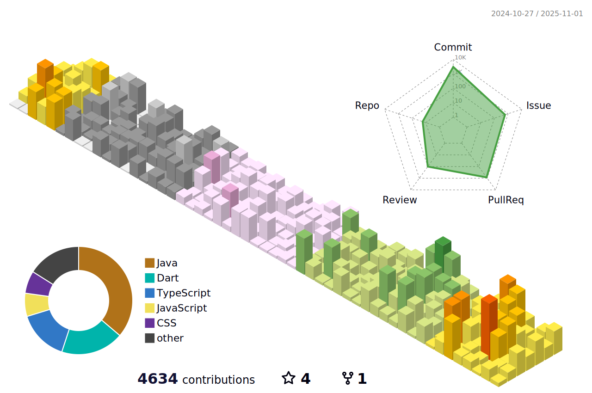

<!-- Cassiiopeia's standout GitHub Profile README -->

<p align="center">
  
</p>

<p align="center">
  
</p>

<p align="center">
  
  
  
  
  
</p>

---

## 👋 About Me

- **Java & Spring Boot 기반 백엔드 개발자**  
- **React, Flutter, Node.js, TypeScript 등 풀스택 경험**
- **활동적인 사이드 프로젝트 러버**

---

<!-- 수정하지마세요 자동으로 동기화 됩니다 -->
## 최신 버전 : v1.1.2 (2025-11-25)
[전체 버전 기록 보기](CHANGELOG.md)

## 🛠️ Tech Stack 💻

| Technology | Specialization | Technologies |
|:-----------|:---------------|:-------------|
| **Core Programming** | The Basics |     |
| **Web Technologies** | The Foundation |    |
| | Frameworks & Libraries |     |
| | Backend & Auth |     |
| | UI & Styling |    |
| **Data Management** | Databases |     |
| | Cache & Search |   |
| | BaaS/SaaS |  |
| **AI & ML** | Technologies |     |
| **DevOps** | Infra & Cloud |   |
| | CI/CD |   |

---

## 🌟 Featured Projects

### 🚀 [RomRom-BE](https://github.com/TEAM-ROMROM/RomRom-BE) | [RomRom-FE](https://github.com/TEAM-ROMROM/RomRom-FE)
(2024.10 ~ 진행 중)
> **물물교환 시스템 + AI 가격측정 + 알고리즘 물건 매칭**
- 실시간 물건 매칭/추천, AI 기반 가격 산정, 사용자 친화적 물물교환 플랫폼
- 백엔드, 프론트엔드 모두 참여

### 🌍 [Tripgether-BE](https://github.com/TEAM-Tripgether/Tripgether-BE) | [Tripgether-AI](https://github.com/TEAM-Tripgether/Tripgether-python)
(2025.09 ~ 2025.11)
> ** AI를 활용한 여행 가이드 시스템**
- SNS(릴스·쇼츠·사진)에서 장소 정보를 AI로 자동 추출해 개인 여행 지도를 생성해주는 서비스
- 여행 코스·가이드 자동 생성 판매까지 연결되는 여행 가이드 플랫폼

### 🦜 [Malsami-BE](https://github.com/Sejong-Balsamic/Malsami-BE) | [Malsami-FE](https://github.com/Sejong-Balsamic/Malsami-BE)
(2023.03 ~ 2024.03)
> **대학 교육관리 시스템**
- 자료/질문 게시판, 임베딩 기반 AI 자료 추천, 강의 관리 등
- AI/검색/추천/임베딩 시스템 백엔드 개발

---

## ⏰ Coding Stats

<!--START_SECTION:waka-->


**🐱 저의 GitHub 정보에요.** 

> 📦 GitHub의 25.2 kB만큼의 저장소를 사용하고 있어요. 
 > 
> 🏆 4,578 만큼의 Contributions을 2025년에 했어요
 > 
> 🚫 구직중이지 않아요.
 > 
> 📜 43개의 Public Repository를 만들었어요. 
 > 
> 🔑 19개의 Private Repository를 만들었어요. 
 > 
**저는 저녁형 인간이에요. 🦉** 

```text
🌞 아침                     6985 commits        ⬛⬛⬜⬜⬜⬜⬜⬜⬜⬜⬜⬜⬜⬜⬜⬜⬜⬜⬜⬜⬜⬜⬜⬜⬜   06.32 % 
🌆 낮　                     28875 commits       ⬛⬛⬛⬛⬛⬛⬛⬜⬜⬜⬜⬜⬜⬜⬜⬜⬜⬜⬜⬜⬜⬜⬜⬜⬜   26.11 % 
🌃 저녁                     50792 commits       ⬛⬛⬛⬛⬛⬛⬛⬛⬛⬛⬛⬜⬜⬜⬜⬜⬜⬜⬜⬜⬜⬜⬜⬜⬜   45.93 % 
🌙 밤　                     23933 commits       ⬛⬛⬛⬛⬛⬜⬜⬜⬜⬜⬜⬜⬜⬜⬜⬜⬜⬜⬜⬜⬜⬜⬜⬜⬜   21.64 % 
```
📅 **제가 가장 생산적인 날은 금요일이에요.** 

```text
월요일                      16220 commits       ⬛⬛⬛⬛⬜⬜⬜⬜⬜⬜⬜⬜⬜⬜⬜⬜⬜⬜⬜⬜⬜⬜⬜⬜⬜   14.67 % 
화요일                      20986 commits       ⬛⬛⬛⬛⬛⬜⬜⬜⬜⬜⬜⬜⬜⬜⬜⬜⬜⬜⬜⬜⬜⬜⬜⬜⬜   18.98 % 
수요일                      13658 commits       ⬛⬛⬛⬜⬜⬜⬜⬜⬜⬜⬜⬜⬜⬜⬜⬜⬜⬜⬜⬜⬜⬜⬜⬜⬜   12.35 % 
목요일                      12201 commits       ⬛⬛⬛⬜⬜⬜⬜⬜⬜⬜⬜⬜⬜⬜⬜⬜⬜⬜⬜⬜⬜⬜⬜⬜⬜   11.03 % 
금요일                      21004 commits       ⬛⬛⬛⬛⬛⬜⬜⬜⬜⬜⬜⬜⬜⬜⬜⬜⬜⬜⬜⬜⬜⬜⬜⬜⬜   18.99 % 
토요일                      11076 commits       ⬛⬛⬛⬜⬜⬜⬜⬜⬜⬜⬜⬜⬜⬜⬜⬜⬜⬜⬜⬜⬜⬜⬜⬜⬜   10.02 % 
일요일                      15440 commits       ⬛⬛⬛⬜⬜⬜⬜⬜⬜⬜⬜⬜⬜⬜⬜⬜⬜⬜⬜⬜⬜⬜⬜⬜⬜   13.96 % 
```


📊 **저는 이번주를 이렇게 시간을 보냈어요.** 

```text
🕑︎ Timezone: Asia/Seoul

💬 프로그래밍 언어들: 
Dart                     1 hr 56 mins        ⬛⬛⬛⬛⬛⬜⬜⬜⬜⬜⬜⬜⬜⬜⬜⬜⬜⬜⬜⬜⬜⬜⬜⬜⬜   19.95 % 
Java                     1 hr 24 mins        ⬛⬛⬛⬛⬜⬜⬜⬜⬜⬜⬜⬜⬜⬜⬜⬜⬜⬜⬜⬜⬜⬜⬜⬜⬜   14.46 % 
YAML                     1 hr 11 mins        ⬛⬛⬛⬜⬜⬜⬜⬜⬜⬜⬜⬜⬜⬜⬜⬜⬜⬜⬜⬜⬜⬜⬜⬜⬜   12.23 % 
Markdown                 1 hr 4 mins         ⬛⬛⬛⬜⬜⬜⬜⬜⬜⬜⬜⬜⬜⬜⬜⬜⬜⬜⬜⬜⬜⬜⬜⬜⬜   11.14 % 
Python                   57 mins             ⬛⬛⬜⬜⬜⬜⬜⬜⬜⬜⬜⬜⬜⬜⬜⬜⬜⬜⬜⬜⬜⬜⬜⬜⬜   09.86 % 

🔥 에디터들: 
IntelliJ IDEA            6 hrs 53 mins       ⬛⬛⬛⬛⬛⬛⬛⬛⬛⬛⬛⬛⬛⬛⬛⬛⬛⬛⬜⬜⬜⬜⬜⬜⬜   71.15 % 
Cursor                   2 hrs 47 mins       ⬛⬛⬛⬛⬛⬛⬛⬜⬜⬜⬜⬜⬜⬜⬜⬜⬜⬜⬜⬜⬜⬜⬜⬜⬜   28.85 % 

🐱‍💻 프로젝트들: 
EarLocAlert              2 hrs 34 mins       ⬛⬛⬛⬛⬛⬛⬛⬜⬜⬜⬜⬜⬜⬜⬜⬜⬜⬜⬜⬜⬜⬜⬜⬜⬜   26.63 % 
RomRom-FE                2 hrs 31 mins       ⬛⬛⬛⬛⬛⬛⬛⬜⬜⬜⬜⬜⬜⬜⬜⬜⬜⬜⬜⬜⬜⬜⬜⬜⬜   26.02 % 
TripGether-BE            1 hr 33 mins        ⬛⬛⬛⬛⬜⬜⬜⬜⬜⬜⬜⬜⬜⬜⬜⬜⬜⬜⬜⬜⬜⬜⬜⬜⬜   16.08 % 
tripgether-python        57 mins             ⬛⬛⬜⬜⬜⬜⬜⬜⬜⬜⬜⬜⬜⬜⬜⬜⬜⬜⬜⬜⬜⬜⬜⬜⬜   09.83 % 
Cassiiopeia              37 mins             ⬛⬛⬜⬜⬜⬜⬜⬜⬜⬜⬜⬜⬜⬜⬜⬜⬜⬜⬜⬜⬜⬜⬜⬜⬜   06.49 % 

💻 운영 체제들: 
Mac                      7 hrs 34 mins       ⬛⬛⬛⬛⬛⬛⬛⬛⬛⬛⬛⬛⬛⬛⬛⬛⬛⬛⬛⬛⬜⬜⬜⬜⬜   78.13 % 
Windows                  2 hrs 7 mins        ⬛⬛⬛⬛⬛⬜⬜⬜⬜⬜⬜⬜⬜⬜⬜⬜⬜⬜⬜⬜⬜⬜⬜⬜⬜   21.87 % 
```

**저는 주로 Java 언어를 사용해요.** 

```text
Java                     33 repos            ⬛⬛⬛⬛⬛⬛⬛⬛⬛⬛⬛⬛⬛⬛⬛⬜⬜⬜⬜⬜⬜⬜⬜⬜⬜   58.93 % 
TypeScript               4 repos             ⬛⬛⬜⬜⬜⬜⬜⬜⬜⬜⬜⬜⬜⬜⬜⬜⬜⬜⬜⬜⬜⬜⬜⬜⬜   07.14 % 
Python                   4 repos             ⬛⬛⬜⬜⬜⬜⬜⬜⬜⬜⬜⬜⬜⬜⬜⬜⬜⬜⬜⬜⬜⬜⬜⬜⬜   07.14 % 
HTML                     2 repos             ⬛⬜⬜⬜⬜⬜⬜⬜⬜⬜⬜⬜⬜⬜⬜⬜⬜⬜⬜⬜⬜⬜⬜⬜⬜   03.57 % 
PowerShell               1 repo              ⬜⬜⬜⬜⬜⬜⬜⬜⬜⬜⬜⬜⬜⬜⬜⬜⬜⬜⬜⬜⬜⬜⬜⬜⬜   01.79 % 
```


 Last Updated on 2025년 12월 01일 19:02:51 UTC UTC
<!--END_SECTION:waka-->

---

## 📈 My GitHub Life



<picture>
  <source media="(prefers-color-scheme: dark)" srcset="https://raw.githubusercontent.com/Cassiiopeia/Cassiiopeia/output/github-contribution-grid-snake-dark.svg">
  <source media="(prefers-color-scheme: light)" srcset="https://raw.githubusercontent.com/Cassiiopeia/Cassiiopeia/output/github-contribution-grid-snake.svg">
  
</picture>
<p align="center">
  
</p>
<p align="center">
  
</p>
<p align="center">
  
  
</p>
<p align="center">
  
</p>

---

## 🤸‍♂️ Fun Facts

- 🧑‍💻 **MBTI:** ESTJ (논리적이고, 리더십 강한 타입)
- 🛠️ 취미: 사이드 프로젝트, LOL, 여행, 영상편집
- 🚀 새로운 협업/아이디어 언제나 환영합니다!

---

<p align="center">
  
</p>

---